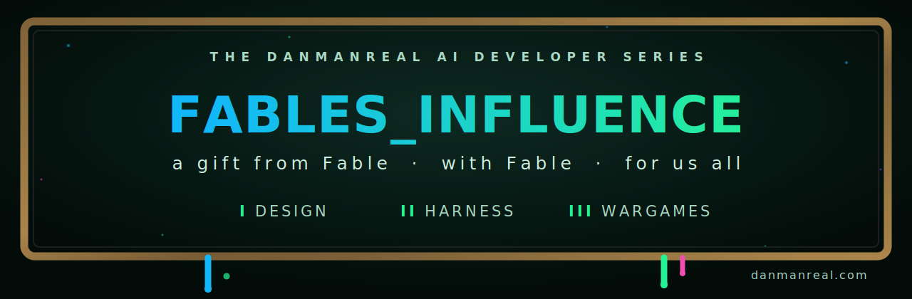

 

&nbsp;

> Hand your Claude Code (**Fable 5**) one prompt. It studies **your** project, interviews
> **you**, and generates a governed, self-verifying finish-line system — playbook,
> ledgers, wargames and all — dressed in the DanManREAL design system.

This is the public companion kit for the [DanManREAL](https://danmanreal.com) AI Developer
Series. It packages the exact working method that Claude Code (**Fable 5**) and I used to
turn a sprawling multi-project workspace into a governed, verifiable, finish-line system —
as a **project-agnostic template your own Fable fills in for YOUR project**.

You don't adapt this kit by hand. You hand it to your agent, and your agent adapts it to you.

---

## The 60-second quickstart

1. **Get the kit.** `git clone` this repo (or *Code → Download ZIP* and unzip it) anywhere
   on your machine — e.g. next to your project.
2. **Open Claude Code at your project root** (the project you want finished), with Fable 5
   (or the strongest Claude model you have).
3. **Paste the genesis prompt.** Open [`GENESIS_PROMPT.md`](GENESIS_PROMPT.md), copy the
   single prompt block, replace the one path placeholder with where you unzipped this kit,
   and paste it into Claude Code.
4. That's it. Your agent reads the kit, surveys your project, asks you a short list of
   owner-only questions, and generates your own **FABLES_HARNESS/** — a complete,
   self-verifying execution system for finishing your project.

## What's inside

| Path | What it is |
|---|---|
| [`GENESIS_PROMPT.md`](GENESIS_PROMPT.md) | The one prompt you paste into Claude Code. Everything starts here. |
| [`START_HERE.md`](START_HERE.md) | The human tour: what gets generated, how the flow works, what to expect. |
| [`skills/dmr-danmanreal-design/`](skills/dmr-danmanreal-design/) | **The "Use DanManREAL DESIGN" skill** — the canonized DanManREAL visual design system (SKILL.md + written canon + byte-exact exemplar). Your agent installs it into your project so everything it builds for you can carry the look. |
| [`template/`](template/) | The **harness template**: the authoritative spec + file templates for the prompt playbook (interactive HTML + machine-readable JSON), the execution-status truth file, five durable ledgers, four meta-control prompts, and `verify_bundle.py` — the integrity gate that proves the generated harness is internally consistent. |
| [`wargames/`](wargames/) | The **wargame method**: how to pressure-test the plan *before* executing it — executor-blind mission briefs, an eight-point definition of done, a grading ledger, a red-team pass — plus the sanitized findings from the real 24-mission run on the DanManREAL workspace. |
| [`docs/FULL_SCOPE_CATALOG.md`](docs/FULL_SCOPE_CATALOG.md) | The full-maximization artifact catalog — every durable artifact class the original system generated (audits, memory, evals, agent docs, specs, skills, governance, ops), so your agent can offer you the same full scope. |

## What this method actually is

Three ideas, learned the hard way, that compose into one system:

1. **The playbook.** Big AI work fails at the seams — between sessions, between agents,
   between "I did it" and "it's actually done." So the work is compiled into an ordered
   playbook of copy-paste prompt blocks (builder blocks paired with independent read-only
   auditor blocks), rendered as one self-contained HTML file you can click through, with a
   machine-readable JSON twin and a status file that always knows the exact next block.
   Every block's text is SHA-256 anchored; `verify_bundle.py` proves the HTML, the JSON,
   and the status file all agree — so no agent can quietly drift the plan.

2. **The ledgers.** Agents forget; files don't. Every block execution updates durable
   ledgers (evidence index, owner decisions, next-agent handoff, re-entry notes) so any
   fresh session — yours, a different model's, next week's — can resume exactly where the
   last one stopped, with proof instead of vibes.

3. **The wargames.** Before executing anything serious, the plan is attacked: each mission
   is rewritten as an executor-blind brief (could a mid-tier model run this without asking
   questions?), predicted failures each get a counter-move, owner-only decisions become
   explicit `{{PLACEHOLDER}}` gates that BLOCK rather than guess, and a red-team pass tries
   to break the whole thing. The findings from doing this for real are in
   [`wargames/FINDINGS_FROM_THE_REAL_RUN.md`](wargames/FINDINGS_FROM_THE_REAL_RUN.md).

## The safety spine (non-negotiable, baked into every template)

- **Agents never invent owner-only values.** Unknowns become `{{PLACEHOLDERS}}` that block
  execution until the owner supplies them.
- **Owner gates.** Anything that spends money, publishes, deletes, or touches production
  requires an explicit owner OK — the harness marks these and stops.
- **Local commits only; pushing stays a human act.**
- **Evidence or it didn't happen.** A block is complete when its artifacts exist on disk
  and are recorded in the evidence ledger — not when an agent says so.
- **Independent audit.** Builder blocks are paired with read-only auditor blocks meant for
  a *second* agent (a fresh Claude session, Codex CLI, or any capable CLI agent).

## Requirements

- [Claude Code](https://claude.com/claude-code) with Fable 5 (best) or another strong Claude model.
- A project you want to finish (any language, any stack — the kit is project-agnostic).
- Optional but recommended: a second CLI agent for the auditor blocks.

## License

MIT — see [`LICENSE`](LICENSE). The **DanManREAL** name, logo, and brand identity are not
licensed for use as your own branding; the design system is offered so you can build
beautiful things with it, not to impersonate DanManREAL.

## Community

**[Join the Discord →](https://discord.gg/5KhQ8jeaTH)** — come show what your Fable built
with this kit. Want to promote it or feature it in your own content? I'll have no problem
with it, as long as it's respectful.

---

*Built by Fable, with Fable, for us all.* 💙
